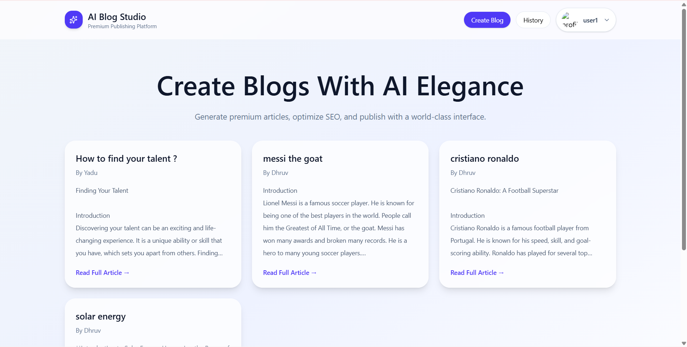
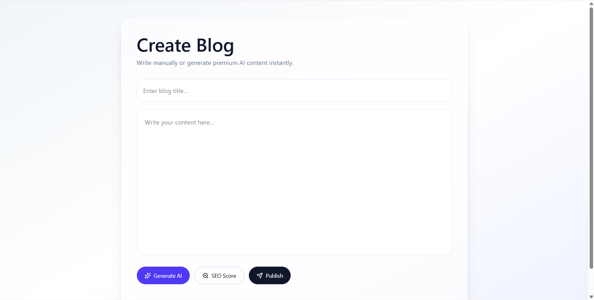
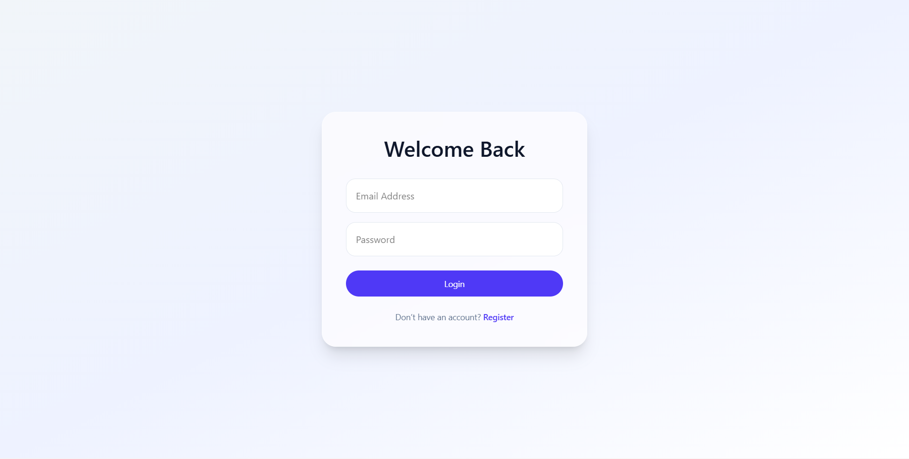
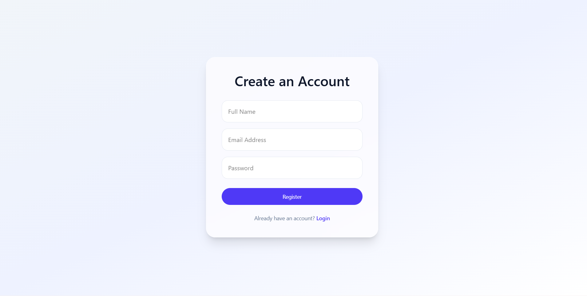

<div align="center">

# ✨ AI Blog Platform

### Premium MERN Stack Blogging Platform with AI-Powered Content Generation

Generate blogs instantly, optimize SEO, manage content, and publish with a modern premium UI.

<br>

</div>

---

# 🚀 Live Features

✅ User Registration & Login  
✅ Secure Authentication  
✅ AI Blog Generator  
✅ SEO Score Checker  
✅ Create / Read Blogs  
✅ Blog History  
✅ Profile Photo Upload  
✅ Premium Dashboard  
✅ Glassmorphism UI  
✅ Responsive Design  
✅ Modern Startup Style Interface  

---

# 🛠 Tech Stack

## Frontend

- React.js
- Tailwind CSS
- Framer Motion
- Axios

## Backend

- Node.js
- Express.js

## Database

- MongoDB

## AI Integration

- Groq API / LLM API

---

# 📸 Project Screenshots

## 🏠 Homepage



---

## ✍️ Create Blog



---

## 📖 Login Details



---

## 📖 Register Details



---

# 📂 Folder Structure

```bash
ai-blog-platform/
│── client/
│── server/
│── screenshots/
│── README.md
│── .gitignore
